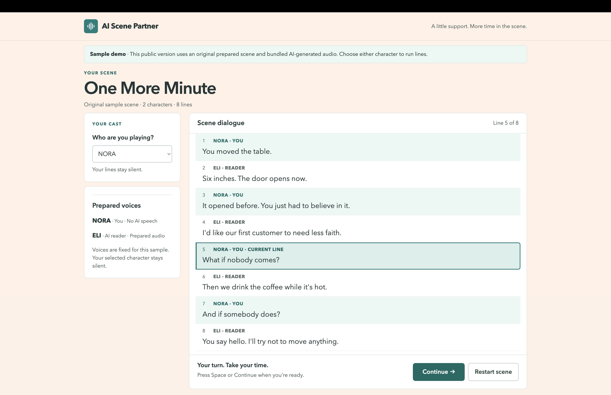
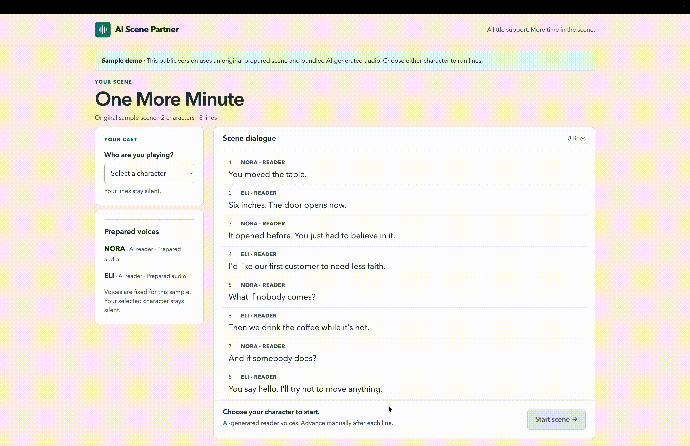
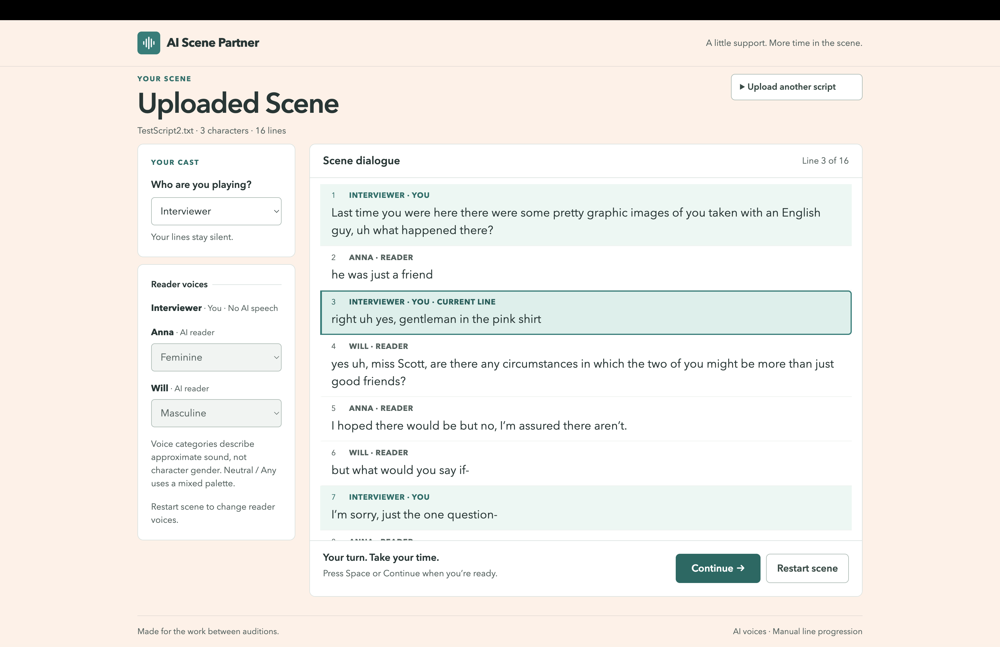

# AI Scene Partner

**AI Scene Partner is a full-stack rehearsal tool that turns uploaded scripts into interactive scene partners for actors.** Upload a TXT or PDF script, select your role, and rehearse while AI-generated reader voices perform the other characters' lines.

**[Try the public demo](https://ai-scene-partner.onrender.com/)**



> **Demo vs. full application:** The public demo uses an original preloaded scene and prepared audio, so it makes no runtime OpenAI requests and requires no API key. The full application runs locally and supports TXT/PDF uploads, structured AI script parsing, configurable reader voices, and live text-to-speech generation.
## Features

* Upload UTF-8 `.txt` or text-based `.pdf` scripts up to 10 MiB.
* Extract and reconstruct screenplay text from multi-page PDFs.
* Parse unstructured scripts into validated characters and dialogue using structured LLM output.
* Select the actor's role so their lines remain silent while the application reads the other characters.
* Assign distinct reader voice categories to AI-read characters.
* Prefetch upcoming speech to reduce pauses during rehearsal.
* Replay reader lines without generating the audio again.
* Recover cleanly from transient speech-generation failures.
* Cancel or ignore stale asynchronous work when restarting or changing scenes.
* Normalize generated WAV audio and conservatively trim trailing silence.
* Advance through the scene with on-screen controls or the Space key.
* Run backend and frontend tests without making live OpenAI API calls.

## Public Demo

The deployed demo uses **One More Minute**, an original eight-turn scene created for the project.



It preserves the core rehearsal interaction:

1. Choose either character as your role.
2. Press **Start Scene**.
3. Perform your own lines aloud.
4. Advance when ready.
5. Hear the other character respond using prepared reader audio.
6. Replay lines or restart the scene at any time.

The demo is intentionally a static build. Reader audio is generated in advance and loaded as local assets, so the deployed site contains:

* no API key,
* no backend service,
* no live OpenAI requests, and
* no runtime AI usage costs.

The complete upload, parsing, voice-selection, and live TTS workflow is available when the project is run locally.

## How It Works

```text
TXT / PDF Script
       │
       ▼
 FastAPI Upload API
       │
       ▼
Script Text Extraction
  ├── UTF-8 decoding
  └── PDF layout reconstruction
       │
       ▼
Structured LLM Parsing
       │
       ▼
Pydantic Scene Validation
       │
       ▼
React Rehearsal Interface
       │
       ├── Actor lines → silent
       │
       └── Reader lines
              │
              ▼
        Speech Generation
              │
              ▼
       WAV Post-Processing
              │
              ▼
     Prefetch / Playback Buffer
```

The extraction, parsing, playback, and speech layers are intentionally separated. Once a script has been converted into the validated `Scene` model, character selection and playback no longer need to know whether the original source was TXT or PDF.

## Engineering Highlights

### Structured script parsing

Script text is sent through the OpenAI Responses API with a **strict JSON schema generated from the application's Pydantic `Scene` model**.

The parser is instructed to handle common screenplay conventions such as wrapped dialogue, delivery parentheticals, continuation markers, scene directions, page numbers, and repeated character headings. The returned JSON is then independently validated before entering application state.

This creates a clear boundary between probabilistic script interpretation and deterministic application logic:

```text
unstructured script → structured AI output → schema validation → deterministic playback
```

### PDF reconstruction

Some screenplay PDFs store individual words or glyphs as separately positioned objects rather than ordinary text lines. Naive extraction can therefore split a single sentence into many fragments or return text in the wrong reading order.

The ingestion layer uses `pdfplumber` to reconstruct visual lines from positioned text while preserving meaningful layout and page order. `pypdf` is retained for document validation and synthetic PDF tests.

Image-only/scanned PDFs are deliberately rejected rather than passed through an unreliable OCR fallback.

### Deterministic playback state

The React playback layer models rehearsal as explicit states including actor turns, loading, playback, reader-ready, blocked audio, recoverable speech errors, and completion.

Synchronous guards prevent rapid user actions from racing React renders. A generation counter and request cancellation prevent stale asynchronous responses from playing after a scene has been restarted or changed.

Actor lines never generate speech.

### Speech prefetch and bounded recovery

Reader audio for upcoming lines is prefetched into a small buffer. In-flight promises and completed audio are shared, so foreground playback and prefetch do not generate duplicate requests for the same line.

The backend disables automatic SDK retries because retrying a successful-but-interrupted TTS request could generate and bill the same line twice. Instead, the application classifies failures and owns a single bounded recovery attempt for transient errors.

Permanent failures such as authentication, invalid configuration, or exhausted quota are surfaced without entering a retry loop.

### Audio processing

Reader speech is generated as WAV audio and post-processed on the backend using Python's standard library.

The pipeline:

* conservatively trims contiguous trailing near-silence,
* preserves internal pauses and quiet dialogue endings,
* measures active-window RMS,
* applies bounded volume normalization,
* maintains peak headroom,
* preserves stereo balance, and
* rebuilds WAV output headers using the actual frame count.

Unsupported or unexpected audio-processing cases safely fall back to the original generated audio.

### Reader voice assignment

Each AI-read character can be assigned a **Feminine**, **Masculine**, or **Neutral / Any** presentation category.

Voice assignment is deterministic: characters receive stable slots within the selected category rather than requiring an additional AI classification request. Character names and dialogue are never used to infer gender.

These categories are application-level presentation preferences, not identity classifications.

## Tech Stack

### Frontend

* React 19
* Vite 6
* JavaScript
* CSS
* Node.js built-in test runner

### Backend

* Python 3.13
* FastAPI
* Pydantic
* OpenAI API
* `pdfplumber`
* `pypdf`

### AI / Audio

* Structured LLM script parsing
* OpenAI text-to-speech
* WAV post-processing
* Deterministic speech prefetch and caching

### Testing

* pytest
* Node.js built-in test runner
* Mocked external AI boundaries

## Running the Full Application Locally

### Prerequisites

* Node.js 22 or later
* Python 3.13 or later
* An OpenAI API key

### 1. Configure and start the backend

```bash
cd backend

python3 -m venv .venv
source .venv/bin/activate
pip install -r requirements.txt

cp ../.env.example ../.env
```

Edit the newly created `.env` file and add your OpenAI API key.

Then start FastAPI:

```bash
uvicorn app.main:app --reload
```

The API runs at:

```text
http://127.0.0.1:8000
```

The health endpoint is available at:

```text
http://127.0.0.1:8000/api/health
```

The OpenAI API key is read only by the backend and should never be placed in a Vite/frontend environment variable.

### 2. Start the frontend

In a second terminal:

```bash
cd frontend
npm install
npm run dev
```

Open the URL printed by Vite, normally:

```text
http://localhost:5173
```

Vite proxies `/api` requests to the local FastAPI server.

## Full Local Workflow

Once both services are running:



1. Upload a supported TXT or PDF script.
2. Wait for the script to be extracted and parsed into structured dialogue.
3. Select the character you are performing.
4. Choose reader voice categories for the remaining characters.
5. Start the scene.
6. Perform your own lines aloud.
7. Press **Continue** or Space when ready.
8. Listen to the generated reader lines.
9. Replay, retry, or restart as needed.

Upcoming reader lines are prefetched to reduce waiting during rehearsal.

## API Overview

### Parse a scene

```text
POST /api/scenes/parse
```

Accepts a multipart upload named `script_file`.

Supported inputs:

* UTF-8 `.txt`
* text-based `.pdf`
* maximum size: 10 MiB

The endpoint extracts the source text and returns a validated structured scene.

### Generate reader speech

```text
POST /api/speech
```

Reader requests contain the line text together with its deterministic voice category and slot. Successful responses return WAV audio.

Only reader dialogue is sent for speech generation; the selected actor's lines remain silent.

## Configuration

The backend supports configuration for:

* `OPENAI_API_KEY`
* `OPENAI_MODEL`
* `OPENAI_TTS_MODEL`
* `OPENAI_TTS_VOICE`
* `OPENAI_TTS_VOICES`
* category-specific TTS voice palettes

The default parsing model is `gpt-5-mini`, and the default speech model is `gpt-4o-mini-tts`.

See `.env.example` for the environment-variable template.

## Testing

Backend tests:

```bash
cd backend
.venv/bin/python -m pytest -q
```

Frontend tests:

```bash
cd frontend
npm test
```

Production frontend build:

```bash
npm run build
```

Automated tests mock external AI boundaries, so the test suite does not make live OpenAI requests.

Coverage includes areas such as:

* script extraction,
* scene parsing boundaries,
* speech API behavior,
* voice assignment,
* provider failures,
* audio processing,
* reader prefetch,
* retry behavior,
* resource cleanup,
* actor-line exclusion,
* keyboard interaction, and
* static demo audio.

Browser audio behavior and generated voice quality are also manually tested because they cannot be fully validated through deterministic unit tests.

## Static Demo Build

The public demo is built separately from the full local application:

```bash
cd frontend
npm run check:demo
npm run build:demo
npm run preview -- --host 127.0.0.1
```

Demo mode is enabled explicitly with `VITE_DEMO_MODE=true`.

Prepared reader audio lives under the static demo assets and is loaded through the same playback system used by the full application. Missing or invalid assets produce a controlled error and never fall back to a live API request.

The demo therefore exercises the rehearsal UI, playback state machine, prefetch behavior, replay, restart, and cancellation without exposing credentials or creating runtime API costs.

## Current Limitations

* The full AI workflow currently runs locally rather than as a public hosted backend.
* The public deployment is a fixed sample scene rather than an arbitrary-script upload service.
* Scanned or image-only PDFs are not supported because OCR is not implemented.
* PDF extraction quality depends on the source document's underlying text layer and layout.
* Scene progression is currently manual; the application does not yet listen for the actor to finish speaking.
* The application does not currently record self-tapes.
* Scenes and user settings are not persisted between sessions.
* Generated speech requires an OpenAI API key and may incur API usage costs when running the full application locally.

## Potential Next Steps

* Add speech recognition for hands-free detection of completed actor lines.
* Add integrated self-tape recording and playback.
* Support persistent scenes and rehearsal settings.
* Expand script-format handling and investigate OCR for scanned scripts.
* Add user-adjustable reader pacing and rehearsal controls.
* Explore a hosted authenticated version of the complete upload-and-generation workflow.

## Security and Privacy

* API credentials remain exclusively on the backend.
* `.env` files are excluded from Git.
* Uploaded PDFs are processed in memory and are not permanently stored by the application.
* Error logging avoids dialogue text, credentials, and provider response bodies.
* The public demo contains no API credentials and performs no runtime OpenAI requests.

## Project Status

The core rehearsal workflow is implemented and tested:

**script upload → extraction → structured parsing → role selection → reader voice configuration → prefetched speech playback**

The public deployment demonstrates the rehearsal experience using an original scene and prepared audio, while the complete dynamic workflow is available locally.
